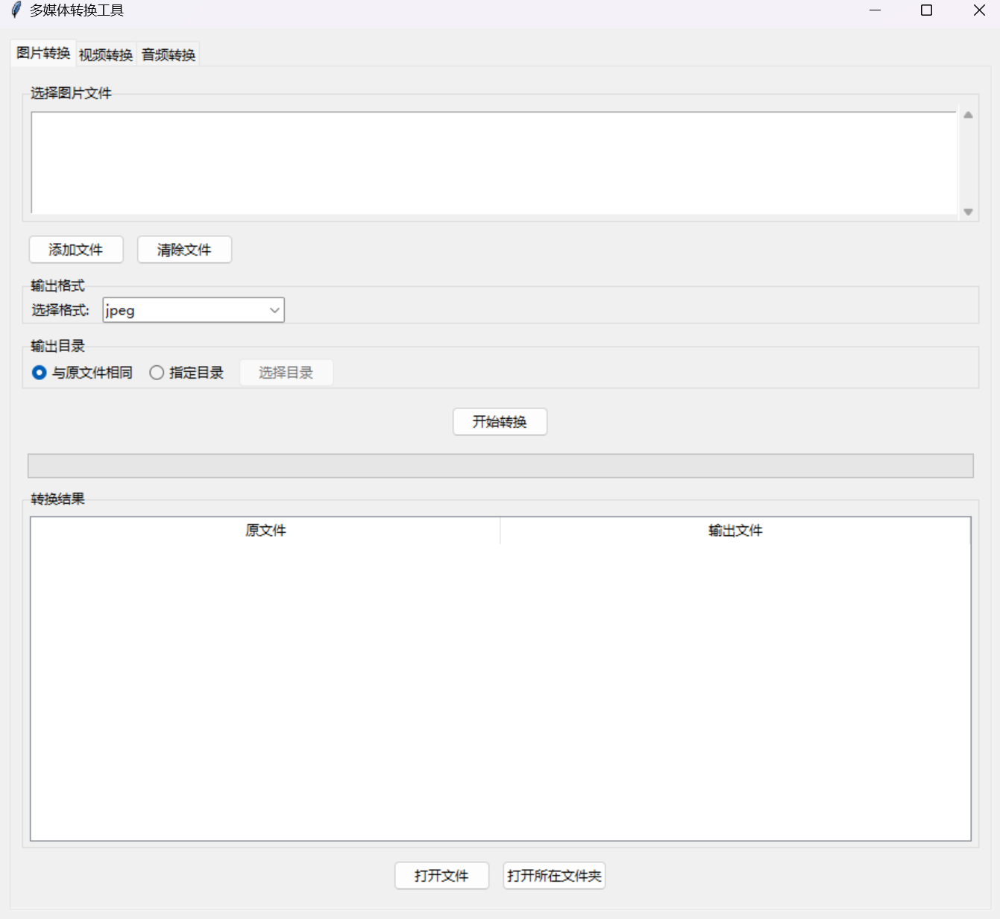
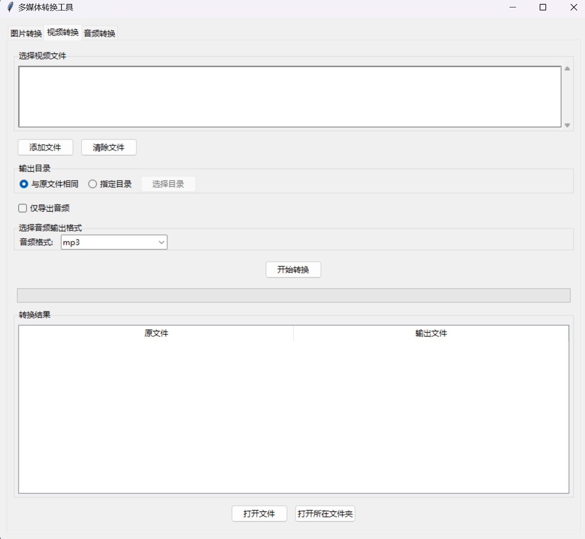
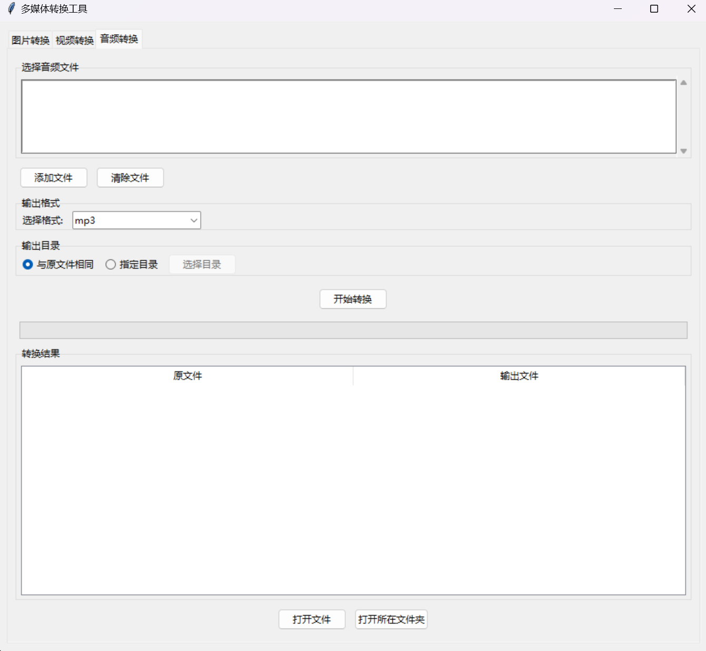

# Video-Image-Photo-Converter

一个简单实用的工具，用于视频、图像和音频格式转换，支持以下功能：
- 图片格式转换（支持简单的 `raw` 文件转换）。
- 视频格式转换及音视频分离。
- 音频格式转换。

---

## 功能特性
- **图片处理**：支持常见图片格式互转。
- **视频处理**：支持视频格式转换，分离音频和视频轨道。
- **音频处理**：支持多种音频格式转换。

---

## 使用方法

### 环境准备
1. **安装 ffmpeg**  
   请先下载并安装 [FFmpeg](https://ffmpeg.org/download.html)。

2. **克隆仓库**  
   使用以下命令将仓库克隆到本地：
   ```bash
   git clone https://github.com/your-repository-url.git
   ```
3.安装依赖
确保已安装 Python 3.x，然后运行以下命令安装项目依赖：
    ```bash
    pip install -r requirements.txt
    ```
4.运行以下命令启动 GUI 界面：
    ```bash
    python gui_converter.py
    ```

界面截图
以下是工具的界面示例：
  
